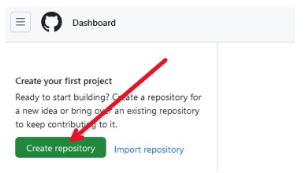
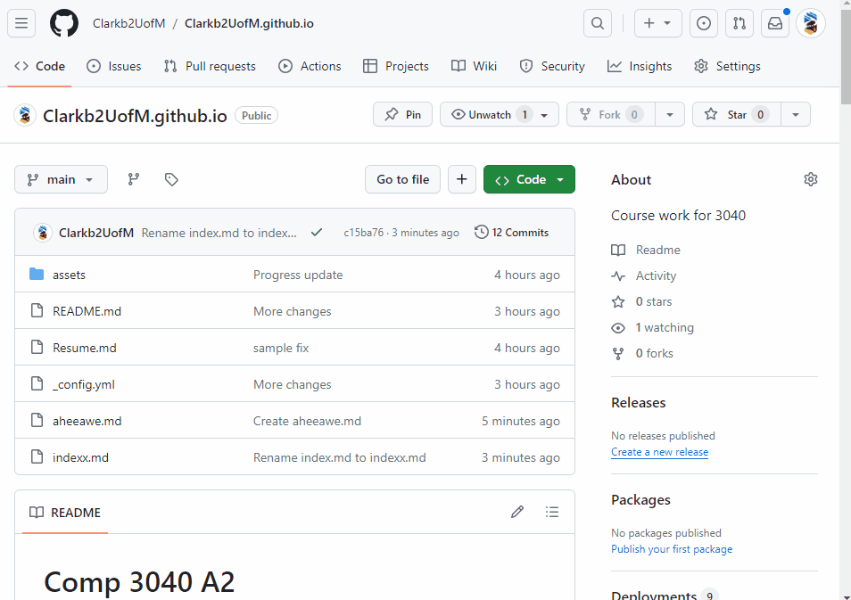

# Comp 3040 A2
## How to Host your Resume on GitHub Pages
By Ben Clark

---
#### Purpose
By the end of this tutorial, you will be able to host your own resume on github pages. 
An example of the finished product is available [here](https://clarkb2uofm.github.io)

For this tutorial, we will be using documents formatted with Markdown language. Andrew Etter, author of the best selling book _Modern Technical Writing_, reccomends the use of markdown for technical doccuments because of it is lightweight, easy to learn and universially used. 

#### Prerequisites
Before beginning, you should have the following:
- A resume in markdown format. You can find a tutorial on how to use markdown [here](https://www.markdowntutorial.com/)
- An account on GitHub. If you do not have an account, you can create one [here](https://github.com/signup)

#### Terminology
Throughout this tutorial, a number of terms are used that may not be accesible to all users. To remedy this, I have descibed them here:
- Repository: A _repository_ is place to store files online
- Commit: A _commit_ is work saved online. _Commiting_ files is saving those files to Github

---

### Step 1 - Creating a Repository
The first thing that will need to be done to host your resume online is to setting up your github account. 
In order to store your resume online, you will need a repository, (a place online to store your files)
1. Sign into your account on [Github](https://github.com/)
2. Click the green button labeled **'Create repository'** on the left hand side of the screen
 

This will take you to the **Create a new repository** page, from here we can continue

3. Enter ``` username.github.io ``` into the repository name feild (where username is your username on GitHub)

Naming your repository in this way lets Github know that you want to create a website from this repository

4. Click the checkbox next to _Add a README file_
5. Lastly click the **'Create repository button'** at the bottom of your screen. 

Your repo is now setup and ready for use.

---

### Step 2 - Uploading files to your Repository
Now that the respoitory is set up, the next step is to upload your resume to the repository.
- Click the button labeled **'Add file'** followed **'Create new file'** by in the drop down menu
- Naviate to the window labeled **'Name your file...'** and enter ```index.md```

Github pages is set up to use ```index.md``` as the homepage of your site
- Paste your resume into the text box below.
Your resume must be formatted as markdown text, see the prerequisites listed above
- After entering your resume, click **'Commit changes...'** to continue

A window will open up asking for details regarding your commit. A commit is a saved file, if you plan on changing your resume in the future, you will still be able to view old versions of your resume by looking at the commits. All of the pre-selected commit options on the screen will work fine for our purposes today.
- _Optionally_, if expect that you will edit your resume again in the future, you can add information in the box labeled 'Extended description' detailing the current state of your resume.
- Finally, click the green **'Commit changes'** button in the bottom right.
Your resume has now been added to the repository

 
---

### Step 3 - Choosing a theme for your site
Github pages gives its users alot of options to customize their sites.
Here are some popular themes that can easily be added to your site
- Slate - Slate is a simple theme that is clean and easy to read,  [Preview](https://pages-themes.github.io/slate/)
- Merlot - Merlot ......,  [Preview](https://pages-themes.github.io/merlot/)
- Time Machine - Time Machine ......,  [Preview](https://pages-themes.github.io/time-machine/)

There are many other themes available for Github pages, a more extensive list can be found [here](https://pages.github.com/themes/)
In this tutorial we will be using the theme Slate

To add the the theme to your site:
- Once again, click the button labeled **'Add file'** followed **'Create new file'** by in the drop down menu
- This file must be named ```_config.yml```

_config.yml is a file that Github uses to help in generate your site. It contains the properties that are used to style and customize your pages.

- add the following block of code to your file

```
    theme: jekyll-theme-slate
    title: Your Name
    description: Digital Resume
```
This will tell Github that you want your theme to be set to slate
- After entering this text, click **'Commit changes...'** to continue
- This will once again bring up the commit options menu. As before, all the default settings will be alright for our purposes right now.
---

At this point, your site is set up. You can view the finished product by going to 

---
### Step 4 - Supporting your site into the future
Your resume is now set up and hosted on Github pages.
If you want to edit your resume in the future, the eaist way to do so is by editting the file directly in Github
- Click on the file containing your resume (index.md)
- Click on the **pencil icon** In the top right-hand corner of the file to begin editing the file
- Click **'Commit Changes...'** When you have finished making changes. 
This will bring up the now familiar commit options menu. The default options in this menu will still suit our purposes
- Click **'Commit Changes'** to save your updated resume

---
### Conclusion
This tutorial outlines only the basics of hosting your resume on gitlab. If you found this helpful I encourage you to explore the other customizability options that Github offers

--- 

### FAQ

**Q:** "Why is Markdown better than a word processor?"
**A:**  Answer

**Q:**  "Why is my resume not showing up?"
**A:**  There are a number of possible reasons your resume isn't showing up, I will outline a few of them below:

1. Your resume is in the wrong folder.
    - By default, Github will look for your resume outside of any folders. If it is in a folder, remove it and try again.
2. Your file names are incorrect
    - Github pages will be looking for the following file name to use as the homepage of your site: `index.md`.

---
### Authors and Acknowledgements
Written by Ben Clark
- Special thanks to Ethan Ducharme and Lyle Arcinas for their constructive feedback in class.
- Credit to Andrew Etter, author of _Modern Technical Writing_
